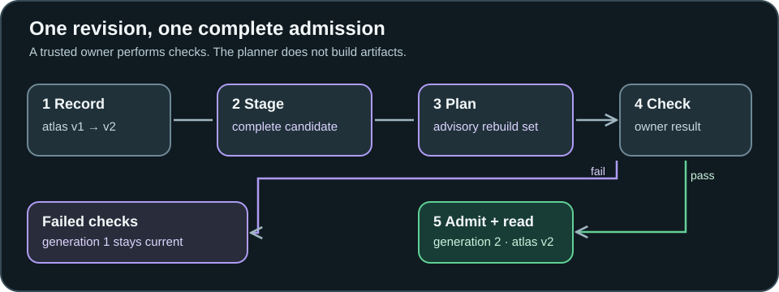

# Living Context

<p align="center"></p>

<p align="center"><strong>Stage a complete source revision. Admit it only when checks pass.</strong></p>

When a document changes, a reader should not see half of the old corpus and half of the new one. Living Context records revisions, admits complete snapshots, and returns text with its source revision and generation. It also plans which hypothetical learned artifacts a change might affect.

> [!NOTE]
> **Research software preview, version 0.1.0.** The maintained Python software is model-free and in memory. It does not train or serve learned context. Local engineering and saved-output replay checks passed; no independent model replication is reported here. See [research results and limits](#research-results-and-limits) and check the current workflow run for hosted CI status.

[Run the examples](#run-the-examples) · [Follow a revision](#follow-a-revision) · [Use the API](#use-the-api) · [Architecture](#architecture) · [Research](#research-results-and-limits) · [Documentation](#documentation-map)

## Who this is for

A researcher comparing refresh policies can stage the same source change and inspect three rebuild sets without running a model. An application developer can use the catalog and text reader to make current and historical source text explicit in a local prototype. A reviewer can replay retained scores and gates without downloading the study model. These are reference workflows, not a ready-made document service.

For example, imagine `atlas` changes from `v1` to `v2` while `beacon` is unchanged. A refresh may rebuild only `atlas`, conservatively include `beacon` because the two old revisions shared a declared training batch, or plan a text fallback for `atlas` during refresh. In every case the new source snapshot stays pending until admission; a failed check leaves the old generation current.

## Run the examples

Use Python 3.11 or 3.13 and [uv](https://docs.astral.sh/uv/). From a **source checkout**, run:

```sh
uv sync --frozen --no-editable --python 3.13
.venv/bin/python -m living_context.example_lifecycle
.venv/bin/python -m living_context.text_reader_example
```

The first command installs the locked source environment as a regular package. The examples use synthetic strings; neither loads a model nor calls an external service. The lifecycle example prints nine lines. Its central transition is:

```text
arm 4 rebuild plan: atlas@v2
arm 5 rebuild plan: atlas@v2, beacon@v1
arm 6 text fallback plan: atlas
rejected checks: generation 1 still serves atlas@v1
admitted generation 2: atlas@v2, beacon@v1, cedar@v1
```

The text reader example prints source before admission at generation 1, new source after admission at generation 2, and `current=None` after explicit deletion:

```text
before admission: generation=1 revision=r1 text=Limit: 10
after admission: generation=2 revision=r2 text=Limit: 20
after deletion: current=None
```

For an **installed wheel**, run the two `python -m living_context...` commands in the environment where you installed the wheel. The wheel contains the Python package and these examples; source-tree paths such as `research/` and `scripts/` are part of the source distribution, not the wheel. [PACKAGE-OMISSIONS.md](PACKAGE-OMISSIONS.md) describes the source archive. The root commands above require a source checkout and its lockfile.

## Follow a revision

<picture>
  <source media="(max-width: 640px)" srcset="assets/readme/living-context-flow-mobile.svg">
  
</picture>

1. **Record.** `Catalog` keeps append-only `DocumentRevision` records with a document ID, revision ID, source text, edit kind, and `as_of` date. It can answer an explicit historical `revision_at` query.
2. **Stage.** `VersionedCorpus.stage_changes` merges edits with the complete current snapshot. Staged data is invisible to `serve`. A full `stage` candidate cannot silently omit a live document; removal must be declared as a deletion.
3. **Plan.** `plan_refresh` compares admitted and staged snapshots. Arm 4 rebuilds changed live documents; arm 5 follows caller-declared co-training edges from old revisions; arm 6 selects changed documents and marks them for text fallback. A deletion produces a retirement set. These are advisory sets, not executed jobs.
4. **Check and admit.** The owner performs its checks and supplies a real Boolean `checks_passed` value. `False` leaves the current generation intact. `True` revalidates the candidate, rejects a stale base, and switches the active snapshot as one process-local step.
5. **Read.** `TextReader` retrieves only admitted source text. Each result names its generation and revision. A planned fallback requires the target revision to have been admitted and the requested generation to still be current. Explicit historical reads are marked `current=False`.

The lifecycle example then deletes `cedar`: its current read disappears in generation 3, while a caller can still request retained generation 1. Removing a source from the active snapshot does not erase history or unlearn model weights.

## Use the API

This example shows the owner-controlled check boundary. Replace `checks_passed` with a Boolean derived from your own validation; the package does not run that validation for you.

```python
from living_context.catalog import Catalog, DocumentRevision, VersionedCorpus
from living_context.text_reader import TextReader

catalog = Catalog()
old = DocumentRevision("policy", "r1", "Limit: 10", "initial", "2026-01-01")
new = DocumentRevision("policy", "r2", "Limit: 20", "number-change", "2026-01-02")
catalog.add_revision(old)
catalog.add_revision(new)
corpus = VersionedCorpus(catalog)
assert corpus.admit(corpus.stage({"policy": old}), checks_passed=True)
reader = TextReader(corpus)

pending = corpus.stage_changes({"policy": new})
assert corpus.admit(pending, checks_passed=False) is None
assert reader.read("policy").revision == "r1"
assert corpus.admit(pending, checks_passed=True)
assert reader.read("policy").revision == "r2"
```

The `True` values above are illustrative owner assertions, not artifact verification. For an artifact-bearing candidate, `VersionedCorpus.verify_artifacts(staged, manifests, artifact_bytes)` can check the complete manifest set, exact live source revisions, SHA-256 digests, target coverage, and copied bytes. It returns a receipt bound to that staged object and corpus instance; pass it to `admit(staged, checks_passed=..., receipt=receipt)`. The caller still supplies the Boolean. A receipt checks consistency of supplied bytes, not caller identity or whether training actually consumed those sources. See [the full admission contract](docs/ARCHITECTURE.md).

## Architecture

| Component | Responsibility | Boundary |
| --- | --- | --- |
| [`Catalog`](src/living_context/catalog.py) | Store ordered authored revisions and answer `as_of` lookups. | The trusted owner serializes catalog changes. |
| [`VersionedCorpus`](src/living_context/catalog.py) | Freeze complete candidates, reject stale or incomplete admissions, retain admitted generations. | Active switching is atomic for readers of one process-local corpus instance. No disk or cross-machine transaction. |
| [`ArtifactManifest`](src/living_context/artifacts.py) and `verify_artifacts` | Bind optional supplied artifact bytes to exact live sources and issue a temporary receipt. | Digests check bytes, not provenance or training truth. |
| [`DependencyGraph`](src/living_context/dependencies.py) and [`plan_refresh`](src/living_context/refresh.py) | Compute changed-only, declared-dependency, or text-fallback plans. | Edges come from the caller; no discovery, build, or scheduler. |
| [`TextReader`](src/living_context/text_reader.py) | Return admitted source text with revision and generation labels. | Local retrieval only; no generated answer or learned serving. |

The full candidate rule matters because a partial map cannot accidentally replace a complete corpus. The old-revision rule matters because a co-training edge describes what an existing artifact was trained with, before the edit. Retaining generations makes historical reads explicit rather than silently presenting them as current. These rules are useful even if cached text remains the preferred serving approach.

The active switch and receipt are confined to one `VersionedCorpus` instance. The catalog is not a concurrent transaction store; use one trusted owner to serialize mutations. There is no durable ledger, untrusted-writer defense, automatic dependency inference, or model unlearning. [Architecture and trust boundary](docs/ARCHITECTURE.md) documents the exact API behavior.

## Research question

The broader research asks whether a revision-aware learned-context runtime can preserve current-answer accuracy at a lower **total lifecycle cost** than well-engineered cached text retrieval, and under which churn, query, and dependency conditions. A fair comparison must count training and refresh work, cache creation and invalidation, storage, loading, and inference under a matched task and serving setup. The present software exposes the source, admission, and planning boundaries needed to study that question. It does not answer it by itself.

## Research results and limits

These studies use different representations and datasets. Their denominators should not be pooled.

| Evidence | Observed result | Claim boundary |
| --- | --- | --- |
| [Corrected v2 soft-prefix study](research/study-v2/RESULT.md) | Cached text answered 2/2 held-out questions about one synthetic fact; six embedding soft prefixes answered 0/12 exact trials. The predeclared development gate stopped the larger revision/composition study. | Valid negative for its frozen local model, prefix budget, and objectives. It does not rule out other methods. Prefixes are not persisted per-layer KV caches. |
| [Static v3 QLoRA pilot](research/study-v3/RESULT.md) | Per-document adapters and cached source text each answered 8/8 held-out wordings about four synthetic facts; bare model 0/8. | Facts appeared in source-derived training QA; evaluation wording was unseen. No source revision or lifecycle comparison. |
| [Post-pilot revision follow-up](research/study-v3-revision/RESULT.md) | Adapters answered 8/8 in both admitted phases; cached text answered 8/8 then 7/8. Two values changed, one record stayed, one was deleted, and one was added. | A separate narrow synthetic gate. Adapters were trained before serving both snapshots, so this does not measure online update latency, unlearning, or a cost crossover. The one cached-text error was a wrong answer with current text present, not a stale cache. |

The [synthetic revision-workload count](research/revision-workload/RESULT.md) shows that declared dependency closure can approach a full rebuild in some graph shapes. Those operation and storage units are not model-quality or price measurements. Source-only [v2](scripts/verify_study_v2.py), [static v3](scripts/replay_study_v3.py), and [revision v3](scripts/replay_study_v3_revision.py) replays inspect retained text outputs, hashes, scoring, and gates without rerunning inference. Private model and adapter bytes are outside this repository, so source-only replay cannot independently rehash them or repeat model behavior. The [research index](research/INDEX.md) marks superseded v1 claims and current evidence; do not read archived v1 scores as corrected accuracy.

## Troubleshooting

| Observation | What to check |
| --- | --- |
| `uv sync --frozen --no-editable` cannot resolve locally | Initial setup needs the locked dependencies available to uv. Check Python version and the configured package cache or network policy. The examples themselves need no model files. |
| `No module named living_context` | Run the documented non-editable sync first, then use that environment's `.venv/bin/python`, or install the wheel into the Python environment running the command. |
| `candidate omits live documents` | Stage the complete live map, use `stage_changes` for edits, or declare intended removals in `deleted`. |
| `StaleBaseError` | Another candidate was admitted since staging. Stage a fresh candidate against the current generation and repeat its checks. |
| Artifact verification rejects a candidate | Check every live document has target coverage, all manifest source revisions match the staged snapshot, and supplied bytes match lowercase SHA-256 digests. |
| Fallback rejects a read | Confirm the plan marks that document, the target revision is admitted, and the requested generation is current. |

## Documentation map

| Start here | For |
| --- | --- |
| [STATUS.md](STATUS.md) | Current engineering and scientific claim ceiling. |
| [Architecture](docs/ARCHITECTURE.md) | API sequence, artifact receipt, and trust boundary. |
| [CONTRIBUTING.md](CONTRIBUTING.md) | Local tests, evidence replay, contribution rules, and AI-assistance disclosure. |
| [Research index](research/INDEX.md) | Current, superseded, and proposed work; folder roles. |
| [Study results](research/study-v2/RESULT.md), [static pilot](research/study-v3/RESULT.md), [revision follow-up](research/study-v3-revision/RESULT.md) | Methods, raw-evidence links, gates, and interpretation limits. |
| [CITATION.cff](CITATION.cff), [CHANGELOG.md](CHANGELOG.md), [LICENSE](LICENSE), [Security](SECURITY.md) | Citation, changes, MIT code/text license, and sensitive-reporting guidance. The separately obtained model has [third-party terms](research/study-v2/THIRD_PARTY_MODEL.md). |

The [source repository](https://github.com/jlov7/living-context) includes local package and evidence-replay checks; the [workflow](.github/workflows/ci.yml) declares portable gates. Assess hosted CI and available archives from their current run and release records. For nonsensitive bugs use [Issues](https://github.com/jlov7/living-context/issues); follow [Security](SECURITY.md) for sensitive reports.

<sub>This is a personal research and development project. It is not affiliated with, endorsed by, or sponsored by my employer. Any views expressed are my own.</sub>
