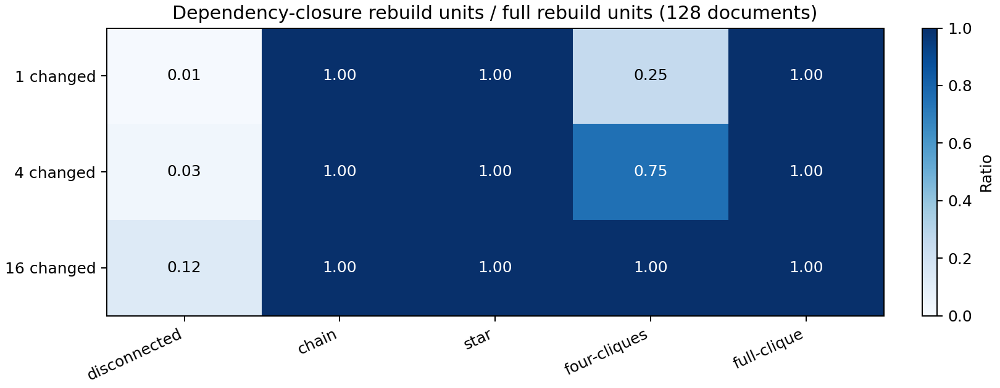

# Synthetic revision workload result

The frozen 128-document count model produced 45 cells: five declared graph
shapes, three edit sizes, and three query rates. The complete table is
[`RESULTS.json`](RESULTS.json), SHA-256
`b49360a0d1b4adfe176b0aeea531bde2faf7f1045cb3afce983e4a9826683c46`.
Two executions produced identical JSON bytes. A separate test mapped each
graph shape to the actual `plan_refresh(5, ...)` API for four changed documents
and matched the independent graph walk. The figure was made with Matplotlib
3.10.9 from the frozen table:

For one changed document, changed-only rebuilds 1 unit in every shape. Closure
rebuilds 1 in a disconnected graph, 32 in four cliques, and all 128 in the
chain, star and full clique. A full rebuild always rebuilds 128. With four
edits, closure rebuilds 4, 96 or 128 depending on graph shape. With 16 edits,
four cliques also reaches all 128. These are direct counterexamples to a
general selective-refresh saving claim: dependency fan-out can erase it.

The graph changes the numerator; query rate changes amortization. For a
one-document edit in four cliques, closure costs 32 rebuild units per edit,
or 32, 3.2 and 0.32 units per read at 1, 10 and 100 reads per edit. Full
rebuild costs 128, 12.8 and 1.28 units per read under those rates. Changed-only
costs 1, 0.1 and 0.01 units per read but may leave co-trained artifacts stale.
The model assumes equal artifact sizes and equal rebuild cost. Its steady
artifact storage is 128 units for every policy; temporary peak is 128 plus the
rebuilt set, so four-clique closure peaks at 160 units in this example and
full rebuild at 256. It assumes external garbage collection of old artifacts
and excludes source history, manifests and runtime metadata.

These are deterministic operation and storage counts. No model was trained or
queried, no accuracy was measured, and no currency or commercial saving can
be inferred. The graph itself is a declared synthetic input, not observed
co-training evidence. The workload source is
[`revision_workload.py`](../../experiments/revision_workload.py); the plot script
is [`plot_revision_workload.py`](../../experiments/plot_revision_workload.py).
